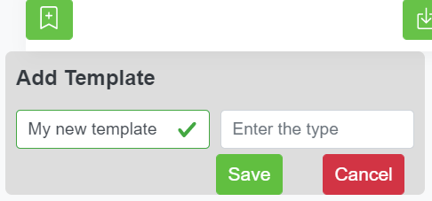

# Templates

On this page you will be able to extract a template from your current report with a given name and type

You will also be able to export any of the selected templates as a 

json file on your local pc, edit the name and type of your template, remove the selected template and import templates from your local pc